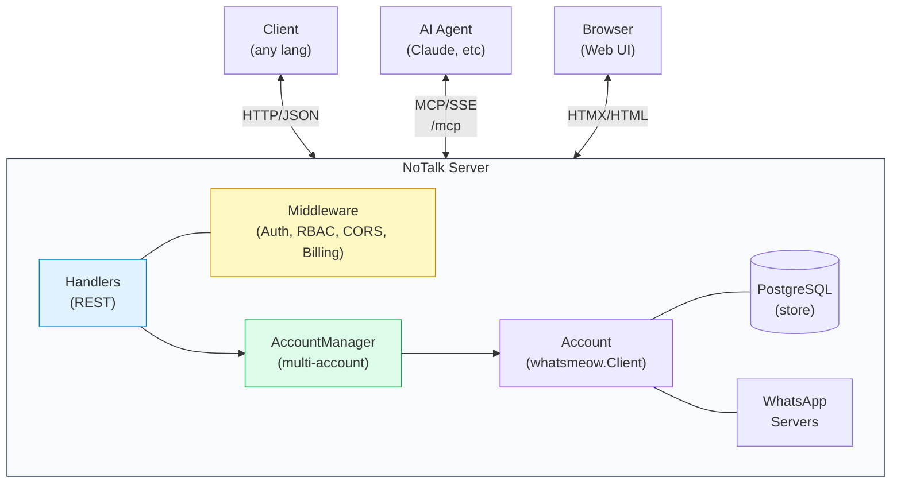
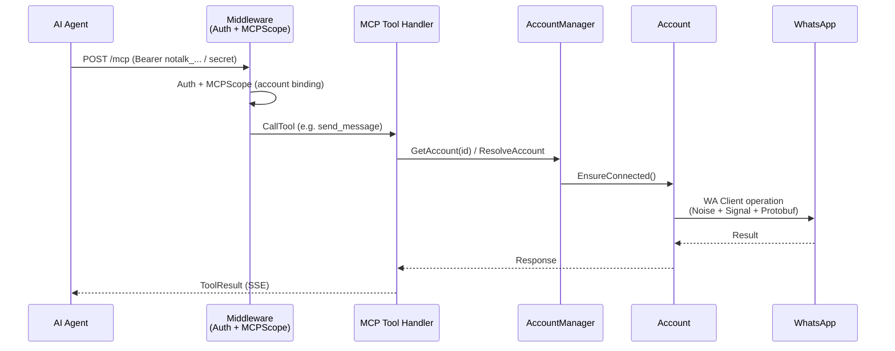
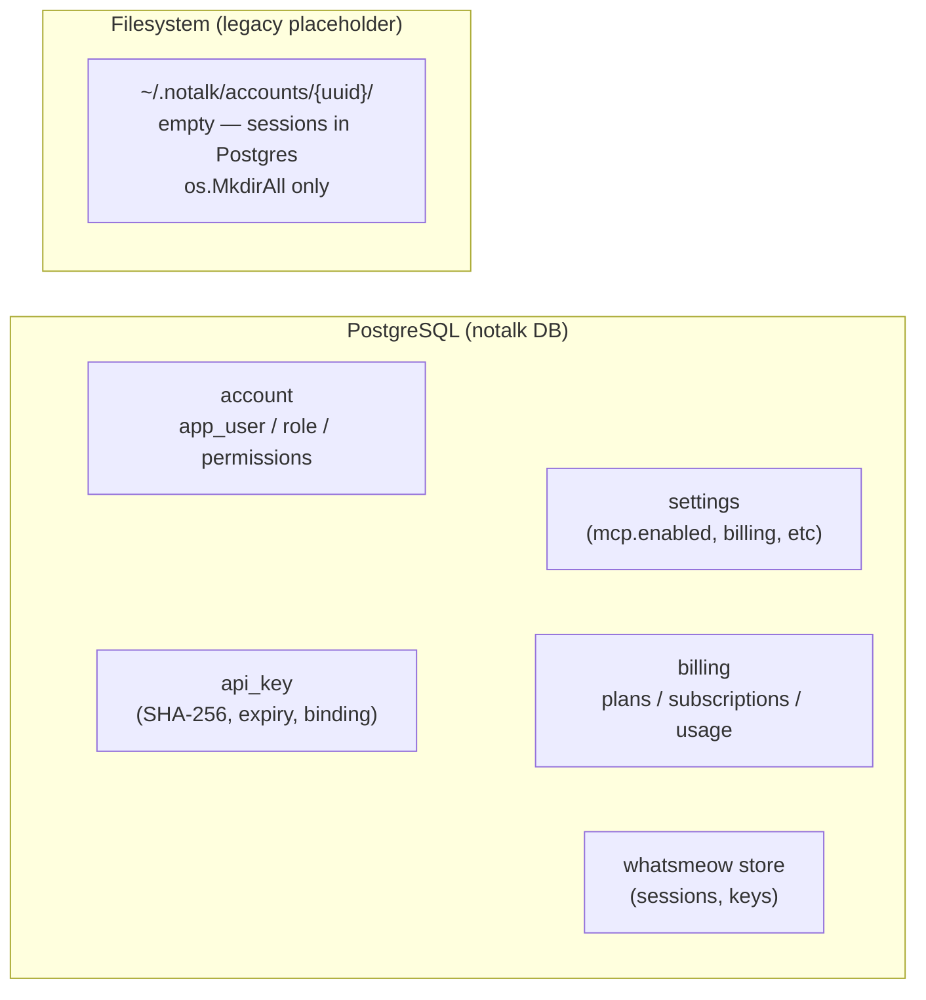

# Architecture

## Overview

NoTalk is an HTTP API server and MCP server implementing WhatsApp's multi-device protocol. It provides a REST API, an MCP endpoint for AI agents, and an embedded web dashboard — all from a single Go binary. No browser or headless Chrome needed.



## Project Layout

```
notalk/
├── cmd/notalk/main.go              Entry point, server bootstrap, MCP transport
├── config/                         TOML configuration files
├── docs/architecture.md            Architecture (this file, Mermaid diagrams)
└── internal/
    ├── config/config.go            Config loading & defaults
    ├── database/
    │   ├── database.go             Account registry, users, roles, API keys, settings (PostgreSQL)
    │   └── billing.go              Plans, subscriptions, usage tracking
    ├── handler/
    │   ├── routes.go               REST API route registration (~55 handlers + 11 billing, see openapi.json)
    │   ├── accounts.go             Account CRUD
    │   ├── whatsapp.go             WhatsApp operations (messaging, groups, etc.)
    │   ├── auth.go                 Login, register, password reset
    │   ├── users.go                User CRUD (admin)
    │   ├── roles.go                Role CRUD (admin)
    │   ├── apikeys.go              API key management
    │   ├── billing.go              Plans, subscriptions, usage
    │   ├── mcp.go                  MCP settings (toggle on/off)
    │   ├── health.go               Health check
    │   ├── proxy.go                Per-account proxy config
    │   ├── webhook.go              Per-account webhook config
    │   ├── messages.go             Message send/history/react/revoke
    │   └── swagger.go              Swagger UI handler
    ├── mcpserver/server.go         MCP tool definitions (26 tools)
    ├── middleware/middleware.go     Auth (JWT + API key + secret), RBAC, CORS, rate limit, billing
    ├── model/model.go              Request/response types, billing models
    ├── service/
    │   ├── account.go              WhatsApp-backed account lifecycle
    │   ├── manager.go              Multi-account orchestration
    │   └── proxy.go                SOCKS5/HTTP proxy support
    ├── smtp/smtp.go                Email delivery for password resets
    └── web/
        ├── routes.go               Web dashboard route registration
        ├── accounts.go             Account UI handlers
        ├── admin.go                User/role admin pages
        ├── auth.go                 Login/register/forgot-password pages
        ├── middleware.go           Web session auth
        ├── render.go               Template rendering
        ├── static/                 CSS, JS assets
        └── templates/              HTML templates (HTMX)
            └── pages/
                ├── messaging.html  Full messaging UI (chats, send, media, bulk)
                ├── pricing.html    Billing plans page
                └── ...
```

## Key Components

### AccountManager (`service/manager.go`)

Owns all accounts. Responsible for:
- Creating/deleting accounts (DB + in-memory map)
- Discovering existing accounts at startup from PostgreSQL
- Graceful shutdown of all connections

### Account (`service/account.go`)

Wraps a single WhatsApp client connection. Each account has:
- **Postgres-backed session** — Signal keys and device state in `whatsmeow` PostgreSQL store via `sqlstore.New(ctx, "postgres", SessionDSN)` (`service/account.go:145`); `DataDir` (`service/manager.go:30`) is a legacy `os.MkdirAll` placeholder, no `session.db`
- **Lifecycle states**: `sleeping` → `connecting` → `active` → (idle timeout) → `sleeping`
- **Idle timer**: Background goroutine polls every 30s, disconnects after `idle_timeout`
- **Auto-connect**: Any API request triggers `EnsureConnected()` — no manual warmup needed
- **Crash recovery**: If the connection drops, the next request detects it and reconnects
- **Phone resolution**: Accepts phone numbers, resolves to JIDs via WhatsApp
- **Per-account rate limiting**: Token bucket (30 msg/min) for send operations
- **Webhook dispatch**: Configurable timeout, retries with exponential back-off, HMAC signing

### Database (`database/database.go`)

PostgreSQL database storing:
- Account registry (ID, phone, name, data dir, idle timeout, status, user_id)
- Users (bcrypt passwords, role FK)
- Roles and permissions (`resource:action` format)
- API keys (SHA-256 hashed, expiry, account binding)
 - Settings (key-value store for runtime config like MCP toggle)
- Billing: plans, subscriptions, daily usage

### MCP Server (`mcpserver/server.go`)

26 tools covering accounts, sessions, messaging, contacts, groups, presence, and profile. Uses Streamable HTTP transport with stateful SSE sessions. Supports account scoping via API key binding or explicit `account_id` parameter.

### Middleware (`middleware/middleware.go`)

- **Auth**: Three-path — static secret key → JWT → API key. Returns 401 on failure.
- **RBAC**: `RequirePermission("resource:action")` checks identity permissions.
- **MCPScope**: Auto-scopes MCP requests to the API key's bound account.
- **CORS**: Configurable origins, methods, headers with preflight support.
- **RateLimit**: Semaphore-based concurrent request limiter (429 when full).
- **BillingEnforcer**: Optional plan-based enforcement (message quotas, feature gates).

## Request Flow

### HTTP API

```mermaid
flowchart LR
    A["HTTP Request"] --> B["CORS"]
    B --> C["Auth<br/>(secret / JWT / API key)"]
    C --> D["RBAC<br/>RequirePermission"]
    D --> E["BillingEnforcer<br/>(if enabled)"]
    E --> F["Handler<br/>(route matched)"]
    F --> G["AccountManager.GetAccount(id)"]
    G --> H["Account.EnsureConnected()<br/>auto-warms if sleeping"]
    H --> I["WA Client operation"]
    I --> J[("WhatsApp<br/>encrypted WebSocket")]

    style A fill:#f1f5f9,stroke:#64748b
    style C fill:#fef9c3,stroke:#ca8a04
    style H fill:#dcfce7,stroke:#16a34a
```



### MCP (Streamable HTTP + SSE) — fixed endpoint `/mcp`



## Data Layout



```text
PostgreSQL:5432/notalk
  tables: account, app_user, role, role_permission, api_key, setting, plans, subscriptions, usage, whatsmeow_caches
Filesystem (legacy, empty placeholder):
  ~/.notalk/accounts/{uuid}/   # created via os.MkdirAll, no session.db
  /data/accounts/{uuid}/       # Docker volume — same, empty
  Signal keys & sessions live in Postgres whatsmeow store, not filesystem
```

## Protocol

NoTalk implements WhatsApp's multi-device protocol:
- **Noise Protocol** for encrypted WebSocket transport
- **Signal Protocol** (libsignal) for end-to-end encrypted messages
- **Protobuf** for message serialization
- No browser, no DOM, no Chrome — direct protocol communication
